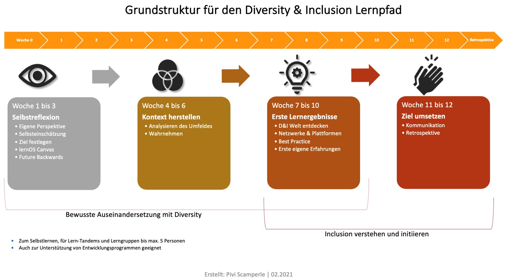

# Grundlagen

Das Verb „lernos" ist die Zukunftsform von „lernen" auf Esperanto (mi
lernos = ich werde lernen, ni lernos = wir werden lernen). lernOS ist
ein Betriebssystem für lebenslanges Lernen und lernende Organisationen.
lernOS ist aber keine Software, sondern „Brainware". Es ist eine Art zu
denken und zu handeln, um als Einzelperson, Team oder Organisation im
21. Jahrhundert erfolgreich zu sein. Das großgeschriebene „OS" im Namen
unterstreicht die Bedeutung der Digitalisierung für unsere vernetzte
Wissensgesellschaft.

Zu lernOS gibt es drei grundlegende Leitfäden, die den Ansatz auf
individueller Ebene (lernOS für Dich), auf Ebene von Teams (lernOS für
Teams) und auf Ebene von Organisationen (lernOS für Organisationen)
beschreiben. Zusätzlich gibt es die lernOS-Toolbox, die oft genutzte
Methoden und Werkzeuge erklärt (z.B. Podcast, Barcamp^1^,
Sketchnoting^2^, Expert Debriefing^3^). lernOS ist nicht auf der
sprichwörtlichen grünen Wiese entstanden, sondern eine Zusammenstellung
von bereits bestehenden und bewährten Methoden. Alle lernOS-Leitfäden
sind unter der offenen Lizenz Creative Commons Attribution (CC BY)^4^
auf der lernOS-Webseite verfügbar und dürfen an die eigenen Bedürfnisse
angepasst werden.

Wenn du weitere Fragen bezüglich lernOS hast oder Unterstützung von
Gleichgesinnten brauchst, kannst du die Community-Plattform
[CONNECT](https://community.cogneon.de/login) nutzen oder unter \#lernOS
auf Twitter schreiben. Beachte: Die Meisterschaft in lernOS ist eine
Frage von Monaten oder Jahren, nicht von Stunden oder Tagen.

Also: Keep Calm & Learn On!

## Einleitung

Dieser lernOS-Guide behandelt das Thema Diversity & Inclusion.
Diversity, zu Deutsch Vielfalt, beschreibt die Gemeinsamkeiten und
Unterschiede von Menschen. Inclusion hingegen verweist auf den
wertschätzenden Umgang mit Vielfalt. Es ist nicht zu verwechseln mit
INKLUSION, ein Wort, das im deutschsprachigen Raum meist in Verbindung
mit dem Thema „Behinderung" verwendet wird. Mach dich auf die Suche nach
deiner Definition. Besonders den breiten Ansatz zu Diversity von der
Charta der Vielfalt solltest du dir ansehen:
<https://www.charta-der-vielfalt.de/>

Noch ein paar Anmerkungen vorneweg:

Dieser lernOS Diversity & Inclusion bezieht sich mit seinen Inhalten,
Links und Hinweisen auf Deutschland. Bei Adaptionen für andere Länder
und Übersetzungen in andere Sprachen solltest du das berücksichtigen und
entsprechende Anpassungen vornehmen.

Er richtet sich sowohl an Einzelpersonen als auch an Gruppen bis 5
Personen. Der Einfachheit halber haben wir für die Ansprache durchgehend
die Du-Form verwendet. Lediglich dort, wo es ausschließlich um
Gruppenerklärungen geht, weichen wir davon ab. Selbstverständlich
verwenden wir eine geschlechtergerechte Sprache mit geschlechtsneutralen
Formen oder dem Gender-Stern. Wir möchten mittels des Gender-Sterns alle
Geschlechter -- auch über die binäre Identität hinaus - benennen. Der
Stern drückt dabei bildhaft durch seine Strahlen die Vielzahl von
möglichen Geschlechtern aus. Mehr Informationen zu gendergerechter
Sprache gibt es auch hier: <https://fairlanguage.com/>

**Die Lernreise im Überblick**

In den nächsten 13 Wochen gehst du auf eine Lernreise. Du startest nicht
mit 1, sondern bei Woche 0. Du wählst dein Ziel selbst, aber der
Lernpfad navigiert dich immer auf dem richtigen (inhaltlichen) Weg.
Dabei eignest du dir Grundlagenwissen an und bekommst Hinweise zu
sinnvollen Quellen sowie Übungen an die Hand, die dir dabei helfen, dein
Ziel in Bezug auf Diversity & Inclusion zu erreichen.

Dazu machst du zuerst eine Bestandsaufnahme: Selbstreflexion -- **Woche
0 bis 3**. Wo startest du mit dem Thema? Zuerst findest du dein Ziel und
lernst, es zu formulieren. Dann legst du den für dich richtigen
Startpunkt fest. Hier ist es besonders wichtig, dass du dein Lernziel
klar benennst und dich nicht in der ganzen Breite des Themas Diversity
verlierst.

Während der **Wochen 4 bis 6** stellst du den Status Quo in deinem
Umfeld fest, damit du dein Ziel und deine Lernreise dorthin in einen
Kontext setzen kannst. Diversity & Inclusion ist ein weitläufiges und
vielschichtiges Thema, es funktioniert nicht nach einem Schema F.
Deshalb ist der Kontext, in dem du dich bewegst, dein Lernziel steckst
und verfolgst, so wichtig. Wenn du dies gut gemacht hast, dann kannst du
dir alle Facetten von Diversity & Inclusion ansehen und findest immer
wieder auf deinen Lernpfad zurück. Denn in den darauffolgenden drei
Wochen wirst du auf deiner Lernreise weiter vorankommen. Du lernst
Methoden kennen, die dir dabei helfen, das Thema bezogen auf dein Ziel
zu verinnerlichen. Und du lernst auch, was dich auf dem Weg ausbremsen
oder ablenken könnte.

In den **Wochen 7 bis 9** hilft dir der Lernpfad, kompetent im Thema zu
werden, deine Kompetenz bezüglich Diversity zu vertiefen und echte
Lernerlebnisse zu generieren. Und dann geht es auch schon auf den
Endspurt zu -- in den **Wochen 10 bis 12** wirst du das, was du in den
Wochen davor gelernt hast, anwenden und ausprobieren.

Du solltest pro Woche mindestens 2 Stunden Zeit einplanen. Es gibt immer
auch Tipps, wenn du mehr machen möchtest. Vor- und Nachbereitungszeiten
können dabei variieren. Und keine Angst, dass es dir zu viel werden
könnte! Du kannst immer mal einen Zwischenstopp einlegen. Außerdem
kannst du dein Lernziel anpassen, tiefer ins Thema einsteigen oder dich
mit anderen (oder in deiner Gruppe) austauschen. Wenn dir mal die
Motivation fehlt oder du dich überfordert fühlst, ist das okay.
Verzweifle nicht! Deine Lernreise verläuft nicht immer linear, hin und
wieder gibt es eben einen Stopp oder die Reise erfolgt langsamer als
geplant, biegt irgendwo ab oder will einfach nur mal kurz innehalten.
All das ist in Ordnung, vergiss das nicht. Und nun: viel Spaß bei deiner
Reise!

Schematische Darstellung der Struktur des Lernpfads.
