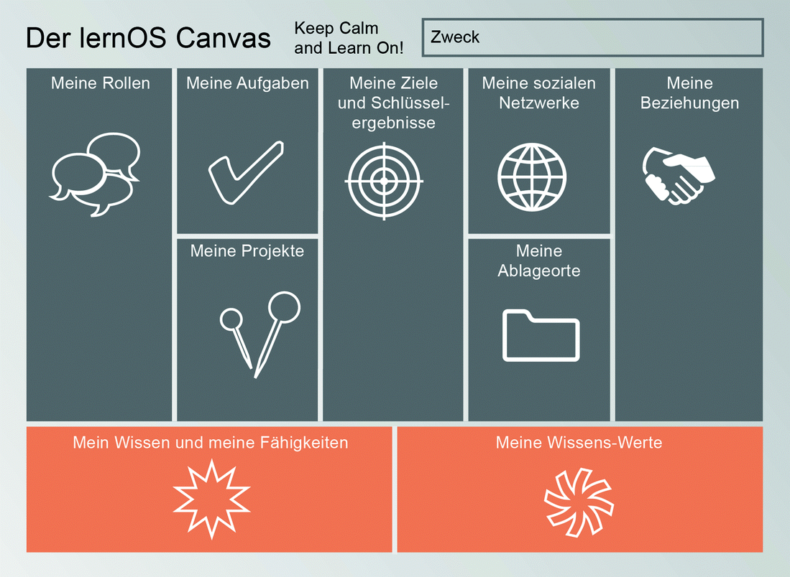
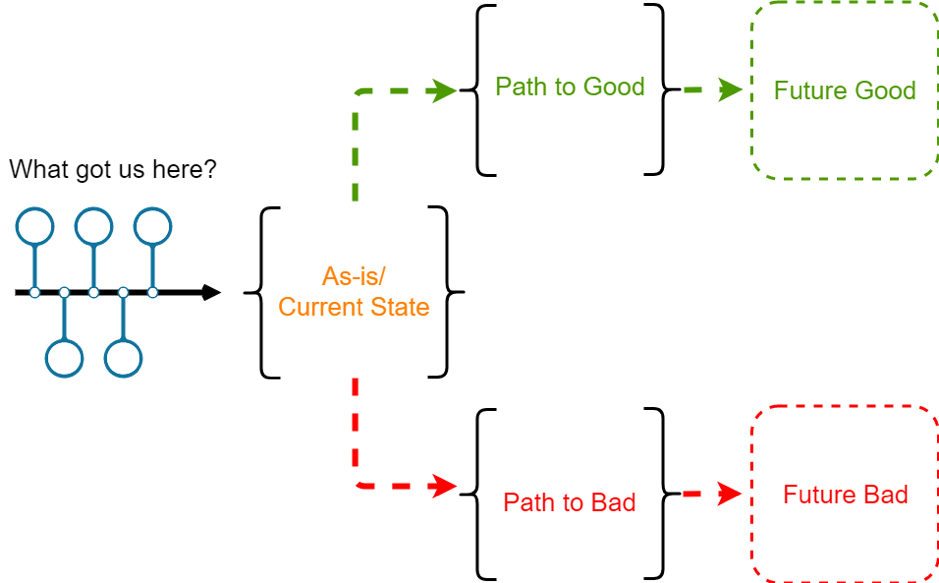
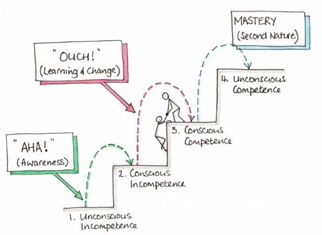

# Lernpfad

Wenn du dich 12 Wochen mit einem Thema beschäftigst, ist das
gleichzeitig sehr viel und sehr wenig Zeit. Dieser Lernpfad enthält

-   eine Anleitung, die dich 12 Wochen (Weeklys^5^) durch deine
    Lernreise führt, mit Denkanstößen, Tipps und wichtigen Leitfragen

-   18 Katas^6^ (Übungen), die dir dabei helfen, das Beste aus dir und
    deinem (Learning)Circle^7^ herauszuholen

-   weiterführende Literatur und Links, um deine Lernreise zu vertiefen
    oder fortzusetzen

**Wie ist dieser Lernpfad aufgebaut?**

Der Lernpfad ist sowohl für Anfänger\*innen als auch für
Fortgeschrittene geeignet. Du findest in diesem Leitfaden zunächst die
Anleitungen für die 12-wöchige Lernreise. Daran schließt sich die Liste
der Übungen, der Kata--Log, an. Unter „Ressourcen" haben wir wertvolle
Hinweise auf Literatur, Videos und andere Quellen für dich
zusammengestellt. Hier gibt es auch einen Glossar, der das verwendete
Fachchinesisch erklärt.

**Wie gehst du mit dem Lernpfad um?**

Nimm dir vor Start der Lernreise (Sprint^8^) Zeit, den Aufbau und die
einzelnen Katas genauer anzuschauen. Manchmal gibt es mehrere Katas in
einer Woche. Such dir eine aus oder mach beide, je nach Lust und Laune.
Es gibt keine Kata-Polizei: Tausch gerne Katas aus oder modifizier sie,
damit sie besser zu deinen Zielen passen. **(siehe
[lernOS-Leitfaden](https://cogneon.github.io/lernos-for-you/de/2-2-1-Kata-1/))**

**Wie kannst du mit anderen Interessierten lernen?**

Du möchtest mit deinem Lernpfad loslegen, würdest aber gerne in einer
Gruppe starten? Wenn du dich in sozialen Netzwerken wie Facebook,
Instagram oder Twitter bewegst, dann frag dort in einem Post nach
weiteren Interessierten. Nutze dafür auch die Hashtags \#lernOS und
\#diversityandInclusion oder \#Diversitymatters.

Du kannst die Autor\*innen des Leitfadens taggen, so kann dein Post
einfacher gesehen und weitergeleitet werden.

**Den Circle organisieren**

**\#ProTipp:** In vielen Fällen ist die Zeit für das Ausführen der
Übungen im Weekly zu kurz. Wir empfehlen daher die
[Flipped-Classroom](https://en.wikipedia.org/wiki/Flipped_classroom)-Methode.
Für jedes Weekly gibt es eine Kata, die jedes Circle-Mitglied als
„Hausaufgabe" vorbereitet, sodass im Weekly mehr Zeit bleibt, die
Ergebnisse zu besprechen. Dies wird begleitet durch Leitfragen, die
ergänzt werden können. Und immer wieder gibt es auch Katas, die
gemeinsam während des Weeklys absolviert werden.

Auch im Circle wählst du deinen eigenen Schwerpunkt für den Sprint --
was willst du neu lernen oder vertiefen? Wo stehst du? Was ist
herausfordernd? Was ist jetzt gerade dran und wie geht es dann weiter?
Was wäre eher ein Schwerpunkt für einen weiteren Sprint? Wie willst du
vorgehen? „Alles auf einmal und dann perfekt" (mit Überforderung/Frust)
oder lieber doch „practice makes progress" (Brandy Agerbeck) -- Übung
bringt Fortschritte (und Spaß).

## Woche 0: Koffer packen / Komm in Reisestimmung / Deine Motivation / Deinen Sprint planen 

**Es geht los!** Deine lernOS-Diversity & Inclusion-Reise beginnt.
Kennst du schon deine Mitreisenden? Wenn nicht, dann ist heute Zeit
dafür. Du wirst deine Circle-Partner\*innen in den nächsten 12 Wochen
mindestens 1 x wöchentlich sehen oder hören. Deshalb nutze heute den
Circle, um ein paar Dinge gemeinsam zu planen.

Es gibt unterschiedliche Reisende. Manche starten die lernOS-Reise und
vertrauen darauf, dass die Reiseleitung einen guten Job gemacht hat, und
lassen die einzelnen Wochen auf sich zukommen. Andere möchten die
Etappenziele kennen und verstehen. Je nachdem, zu welchem Typ du
gehörst, schau dir den lernOS-Pfad an und beschäftige dich mit ihm. Lass
dich nicht entmutigen, wenn du dir nicht auf alle Wochen einen Reim
machen kannst. Die Etappenziele bauen aufeinander auf und die einzelnen
Katas sind wichtig, um die nächsten Schritte nachzuvollziehen.

Eine Besonderheit von Woche 0: Im Circle befasst du dich mit der
Organisation und bekommst zusätzlich Katas (Übungen) für Woche 1. Ab der
folgenden Woche bearbeitest du ausschließlich Katas und kannst den
wöchentlichen Zeitaufwand reduzieren.

**Als Vorbereitung**

-   Kata 0.1: lernOS-Canvas
-   Kata 0.2: Koffer packen

**Im Weekly**

-   Check-in (ca. 10min)

> Willkommen, schön dass du dabei bist! Denk einen Moment darüber nach,
> warum du dich einem lernOS-Circle angeschlossen hast. War es der
> Wunsch nach mehr? Eine Reaktion auf ein Ereignis bei der Arbeit oder
> in deinem Leben? Ob es sich nun um ein Streben oder eine Reaktion auf
> etwas handelt, nimm dir jetzt einen Moment Zeit, um deine persönlichen
> Gründe aufzuschreiben und teil dies sowie weitere Informationen zu
> deiner Person deinem Circle mit. Jedes Circle-Mitglied stellt sich in
> 5 Minuten vor.

-   Austausch (ca. 40 min gesamt)

-   Check-out (ca. 10 min)

> Was nimmst du dir bis nächste Woche vor?
>
> Ziel für das Weekly in der kommenden Woche: ein Ziel entwickeln. Doch
> wie gelingt dies? Folgendes Tool steht dir in der nächsten Woche zur
> Verfügung, um dein Ziel zu schärfen:
>
> Das lernOS-Canvas dient als visuelle Checkliste und als Struktur für
> deine Lernreise. Es bewahrt vor blinden Flecken und lässt sich durch
> den Einsatz von Haftnotizen leicht anpassen. Am besten besprichst du
> dein fertiges lernOS-Canvas mit einer Person vor dem nächsten Weekly.
> Ein Gespräch über das lernOS-Canvas empfiehlt sich auch, wenn du
> Fragen hast und nicht weiterkommst.

**Leitfragen**:

-   Wer bist du? Stell dich vor. (5 min pro Member)

-   Was hat dich bewogen diesen Lernpfad für dich zu beschreiten?

## Woche 1: Wo startest du? 

In dieser Woche geht es darum, den Grundstein für die nächsten 12 Wochen
zu legen. Kannst du alles auf einmal erreichen, was du im lernOS-Canvas
herausgefunden hast, oder ist es sinnvoll, Teilziele zu identifizieren?
Was willst du zum Thema „Diversity\" am Ende des Lernpfads erreicht
haben? Ein Tipp: Wenn du zum ersten Mal eine Lernreise in dieser Form
machst, nimm dir nicht zu viel vor. Du wirst dein Ziel in den nächsten 4
Wochen immer wieder nachjustieren und verfeinern.

**Als Vorbereitung**

-   Kata 1: Wo startest du?

**Im Weekly**

-   Check-in (ca. 10 min)

> Wie geht es dir aktuell? Was hast du seit der letzten Woche erreicht?
>
> Angebot: Mal ein Bild mit deiner nicht dominanten Hand zu deiner
> aktuellen Stimmung.
>
> Warum? Lernfähigkeit, Konzentrationsfähigkeit und Kreativität werden
> gefördert.

-   Austausch (ca. 40 min insgesamt)

Feedback und Tipps zu den Katas (40 min)

-   Check-out (ca. 10 min)

> Was nimmst du dir bis zur nächsten Woche vor?
>
> Wenn sich dein Circle für das Prinzip Flipped Classroom entschieden
> hat, dann bearbeite im Vorfeld des nächsten Treffens die Kata aus
> Woche 2.
>
> Wenn Du mit Working Out Loud^9^ oder lernOS noch nicht vertraut bist,
> dann plane für euch sicherheitshalber ein wenig mehr Zeit ein.

**Austausch: Eure Ziele im Sprint (10 min pro Member)**

-   Teil deine Ziele aus Kata 1 mit den anderen.

**Leitfragen**:

-   Warum machst du das?

-   Was inspiriert dich daran ?

-   Was heißt es für dich, ein Ziel erreicht zu haben?

-   Wie feierst du, wenn du dein Ziel erreicht hast?

```{=html}
<!-- -->
```
-   Hast du einen Termin mit dir selbst in den Kalender eingetragen? Was
    hat dir dabei geholfen?

## Woche 2: Dein Ziel in zehn Worten oder weniger 

In dieser Woche wirst du dein Ziel für die nächsten zwölf Wochen noch
einmal auf Herz und Nieren prüfen. Mit verschiedenen Übungen schärfst du
den Blick auf dein Ziel.

Ein Tipp: Wenn du zum ersten Mal eine Lernreise in dieser Form machst,
nimm dir nicht zu viel vor. Du wirst/kannst dein Ziel in den nächsten
Wochen noch verfeinern oder ändern.

**Als Vorbereitung**

-   Kata 2: Dein Ziel in zehn Worten oder weniger

**Im Weekly**

-   Check-in (2 min pro Member)

> Was hast du seit letzter Woche alles erreicht? Was hattest du dir
> vorgenommen, konntest es aber nicht erreichen? Woran lag das jeweils?

-   Austausch (40 min)

Feedback, und Tipps zu den Katas

Spar nicht mit Applaus, wenn jemand sogar weniger als sieben Worte
braucht!

Allgemeiner Hinweis: Spar generell nicht mit Lob und Wertschätzung. ;-)

-   Check-out

> Wenn du dir letzte Woche etwas vorgenommen hattest, das du nicht
> erreichen konntest: Was kannst du tun, um diese Hindernisse für die
> kommende Woche aus dem Weg zu räumen?
>
> Wer oder was kann dir dabei helfen?
>
> Wenn ihr euch im Circle für das Prinzip Flipped Classroom entschieden
> habt, dann bearbeitet ihr im Vorfeld des nächsten Treffens die Kata
> aus Woche 3.

## Woche 3: Ready steady go?! Schau dir deine Erfahrungen an 

So langsam geht sie los: Deine eigene Diversity-Lernreise. In den
letzten beiden Wochen hast du dich intensiv damit auseinandergesetzt,
warum du dich auf diese Reise begibst und welche Ziele du mit der lernOS
verbindest. Dabei hast du dir klare Ziele gesetzt und überlegt, was du
brauchst, um die Lernreise erfolgreich zu meistern.

In dieser Woche wird es noch einmal darum gehen, dir selbst bewusst zu
machen, aus welchem Blickwinkel du das Thema Diversity betrachtest. Wo
startest du deine Reise? Welche Erfahrungen bringst du mit?

Du kannst diese Woche nutzen, um dich selbst zu reflektieren und zu
prüfen: Durch welche Brille schaue ich auf das Thema Diversity? Und wie
schaut mein Umfeld auf das Thema?

So gehst du sicher, dass du auf deiner Reise alle für dich wichtigen
Aspekte im Blick hast. Diese Woche bietet dir somit auch noch einmal die
Möglichkeit, die gewählte Reiseroute anzupassen oder fehlende Aspekte zu
ergänzen. Zumindest bist du für die folgenden Wochen gerüstet.

**Als Vorbereitung**

-   Kata 3: Ready steady go?! Schau dir deine Erfahrungen an

**Im Weekly**

-   Check-in (2 min pro Member)

> Was hast du seit dem letzten Lerntreffen gemacht? Wie sicher bist du
> mit der Zielsetzung? Gab es etwas, worüber du im Nachhinein gestolpert
> bist?
>
> Wenn ja, teil deine Erfahrungen und Gedanken mit den anderen, wenn du
> magst.

-   Austausch über die Kata(s) (40 min)

-   Check-out

> Plane den nächsten Termin.
>
> 1\. Was nehme ich aus der Runde heute für mich mit in die nächste
> Woche?
>
> 2\. Was nehme ich mir bis zum nächsten Mal vor?
>
> 3\. Brauche ich noch etwas aus der Runde bis zum nächsten Termin?
>
> Wenn ihr euch im Circle für das Prinzip Flipped Classroom entschieden
> habt, dann bearbeitet ihr im Vorfeld des nächsten Treffens die Kata
> aus Woche 4.

## Woche 4: Schau dich um und nimm wahr 

Viele von uns denken bei dem Thema Diversity & Inclusion zuerst an das
Thema Frauen oder Frauenquoten oder an Menschen mit Behinderung. Dabei
hat Diversity weit mehr Dimensionen. Diversity bedeutet auch Vielfalt
bezogen auf das Alter bzw. die Generationen, auf die ethnische Herkunft
und Nationalität oder die sexuelle Orientierung oder geschlechtliche
Identität. Vielfalt kann sichtbar sein, sich aber auch - auf den ersten
Blick - unsichtbar ausdrücken. Auch die soziale Herkunft (die im Übrigen
auch nicht sichtbar ist) kann von Bedeutung sein. Ebenso wichtig ist zu
wissen, dass ein einzelner Mensch viele verschiedene Dimensionen in sich
vereint.

Ein Team im Unternehmen oder im Sport besteht aus Individuen, die für
sich schon mehrere Dimensionen von Vielfalt abdecken. Und da diese
Gruppen so vielfältig sein können, ist es umso wichtiger, mit dieser
Vielfalt kompetent umzugehen - als Führungskraft, als Unternehmen, als
Verein, Gemeinde etc. Alle Angebote sollten so gestaltet sein, dass sich
alle angesprochen, angenommen und unterstützt fühlen.

Es muss nicht immer groß Diversity draufstehen, um auch Diversity zu
sein. Schau also mal genauer hin. Wie engagiert ist dein Umfeld zum
Thema Diversity & Inclusion schon? Die nächsten Übungen helfen dir,
genau zu analysieren, wie dein Umfeld mit dem Thema umgeht. Anregungen
findest du hier: <https://www.charta-der-vielfalt.de/>

Du wirst in 3 Phasen vorgehen.

Phase 1: Schau dich um und nimm wahr! -- Das Identifizieren von internen
und externen Faktoren

Phase 2: Wie divers ist dein Umfeld wirklich?

Phase 3: Mit gutem Beispiel voran! -- Lernen von den anderen.

Dabei ist es wichtig, in den Phasen 1 und 2 nicht gleich in die
Beurteilung zu gehen oder sofort Maßnahmen abzuleiten. Erst mal solltest
du alles vorbereiten, um den Kontext herstellen zu können und dir daraus
später ein Gesamtbild zu machen.

Sicher ist es auch gut, wenn du Unterstützung hast und in Phase 2 die
Stakeholder kennenlernst, die dir vielleicht bei der Umsetzung helfen
können.

Versuch, alle Elemente zusammenzutragen, die mit Diversity & Inclusion
im Zusammenhang stehen.

**Als Vorbereitung**

-   Kata 4: Schau dich um und nimm wahr!

**Im Weekly**

-   Check-in (2 min pro Member)

> Wie geht es dir und den anderen? Wie fühlst du dich, wenn du an deine
> Lernprozesse und bisherigen Fortschritte denkst?
>
> Gibt es etwas, das dich aus den vorangegangenen Wochen in der
> „Selbstreflexion" noch beschäftigt und du mit der Gruppe teilen
> möchtest? -- Fühlt sich dein Ziel noch stimmig an? -- Hört euch
> gegenseitig zu und achtet darauf, welche Unterstützung jemand braucht.

-   Austausch über die Katas (25 min)

> Tausch dich über deine Ergebnisse mit den anderen in deinem Lernzirkel
> aus. Nimm die Ergebnisse der anderen als Inspiration für die nächsten
> Phasen mit auf.

-   Check-out

> Plane den nächsten Termin.
>
> 1\. Was nehme ich aus der Runde heute für mich mit in die nächste
> Woche?
>
> 2\. Was nehme ich mir bis zum nächsten Mal vor?
>
> 3\. Brauche ich noch etwas aus der Runde bis zum nächsten Termin?

## 

## Woche 5: Wie divers ist dein Umfeld wirklich?

Du hast in der vergangenen Woche viel recherchiert und zusammengetragen,
um den Kontext zum Thema Diversity & Inclusion in deinem Umfeld
herzustellen.

In dieser Woche sollst du lernen, den Blick für andere Persönlichkeiten
und deren Bedürfnisse zu öffnen.

Mit Vielfalt im Alltag wertschätzend umzugehen, heißt, dass du
unterschiedliche Eigenschaften und Lebensweisen innerhalb deiner
Zielgruppe berücksichtigst. Das können aber ziemlich viele sein! Hast du
dich auch schon gefragt, wie du Diversität in deinem Umfeld überhaupt
wahrnimmst? Wer/was ist für dich „divers" oder „anders" und wenn ja,
warum?

Zur Orientierung gibt es verschiedene Hilfsmittel. Hier ein Beispiel:

Im Zuge der wissenschaftlichen Forschung zu Diversity & Inclusion haben
sich seit den 70er Jahren 6 „innere" Diversity-Dimensionen etabliert,
die im Laufe der Zeit weiterentwickelt wurden. Wir gehen in unseren
Betrachtungen von den folgenden 7 Dimensionen aus:

1\. Geschlecht und geschlechtliche Identität

2\. Sexuelle Orientierung und Identität

3\. Alter und Generation

4\. Ethnische Herkunft und Nationalität

5\. Religion und Weltanschauung

6\. Körperliche und geistige Fähigkeiten

7\. Soziale Herkunft

**Als Vorbereitung**

-   Kata 5: Wie divers ist dein Umfeld wirklich?

**Im Weekly**

-   Check-in (2 min pro Member)

> Wie geht es dir? -- Bist du mit deinen Fortschritten in Bezug auf dein
> Ziel zufrieden? -- Und warum? Keine Sorge, wenn dich dein Ziel oder
> dein Fortschritt noch nicht zufrieden stellt. In diesem
> lernOS-Diversity-Lernpfad geht es nicht darum, Bestleistung zu
> erbringen oder einen Wettbewerb zu gewinnen. Vielleicht wirst du auch
> feststellen, dass du erst im Laufe der nächsten Wochen dein
> eigentliches Ziel zum Thema Diversity herausarbeitest.
>
> Du lernst sicherlich schon eine Menge durch den regelmäßigen Austausch
> mit den anderen. Das sollest du für dich annehmen und wertschätzen.

-   Austausch (ca. 40 min)

-   Check out (5 min)

> Plane den nächsten Termin.
>
> 1\. Was nehme ich aus der Runde heute für mich mit in die nächste
> Woche?
>
> 2\. Was nehme ich mir bis zum nächsten Mal vor?
>
> 3\. Brauche ich noch etwas aus der Runde bis zum nächsten Termin?

## Woche 6: Mit gutem Beispiel voran

Du hast dich in den letzten beiden Wochen intensiv mit der
Kontextbildung zum Thema Diversity & Inclusion in deinem Umfeld
beschäftigt. Dabei hast du dir zum einen angeschaut, wie dein von dir
gewähltes Umfeld zum Thema aufgestellt ist. Und du hast dir angeschaut
wie vielfältig dein Umfeld ist.

Um weitere Ideen und Anregungen für die Umsetzung deines Ziels zu
bekommen und zu erfahren, was du darüber hinaus zum Thema Diversity &
Inclusion in deinem Umfeld tun kannst, wirst du in dieser Woche den
Blick nach außen richten!

**Als Vorbereitung**

-   Kata 6: Mit gutem Beispiel voran.

**Im Weekly**

-   Check-in (2 min pro Member)

> Was hast du seit dem letzten Lerntreffen gemacht?
>
> Hast Du das 4-layers-of-Diversity-Modell noch mal für dich persönlich
> reflektiert? Wenn ja, magst du vielleicht die eine oder andere
> unsichtbare „Vielfalt" mit den anderen teilen?

-   Austausch (ca. 40 min)

> Tausch deine Ergebnisse mit der Gruppe aus

-   Check-out (1 min pro Member)

> Plane den nächsten Termin.
>
> 1\. Was nehme ich aus der Runde heute für mich mit in die nächste
> Woche?
>
> 2\. Was nehme ich mir bis zum nächsten Mal vor?
>
> 3\. Brauche ich noch etwas aus der Runde bis zum nächsten Termin?

## Woche 7: Wie gut bin ich schon? 

Diversity denken zu lernen, ist eine Reise, allerdings ist nicht das
Ankommen wichtig, sondern der Weg dorthin. Letztlich lernen wir nie aus,
und gerade bei diesem Thema wird es sehr wahrscheinlich so sein, dass
das Ziel nie wirklich erreicht wird. Manchmal tun sich auch neue Ziele
auf.

Deshalb wirst du in Woche 7-9 einen Zwischenstopp einlegen. Du wirst dir
in Ruhe ansehen, wie weit du schon gekommen bist oder wohin du auf jeden
Fall noch einen Abstecher machen solltest. Auf dein Ziel bezogen
bedeutet das, zu lernen, Diversity & Inclusion als Thema immer
mitzudenken. Auch sollst du dir bewusst machen, in welcher Form das
Gelernte vielleicht von deiner Zielsetzung beeinflusst wurde/wird. Was
hindert dich gerade oder hat dich in der Vergangenheit vielleicht daran
gehindert, dein Ziel zu erreichen?

Bist du vielleicht sogar schon so weit, anderen „eine Postkarte" zu
schicken und von deiner Reise zu berichten? Egal, an welchem Punkt du
bist, in den nächsten drei Wochen wirst du Deine Lernreise auf ein
anderes Niveau bringen und in einen größeren Kontext stellen. Also ganz
ähnlich wie in den letzten drei Wochen, aber jetzt nicht bezogen auf
dein Umfeld, sondern auf deinen Wissensstand.

In den letzten Wochen hast du dir dein Umfeld näher angesehen. Nun geht
es darum, dir deine eigene Entwicklung anzuschauen.

Wenn du lernst, Diversity zu denken und zu verinnerlichen, heißt das
auch immer, Schritte in der eigenen Handlungsfähigkeit zu machen. In
dieser Woche lautet die Aufgabe, dein eigenes Wissen und deine
Handlungsfähigkeit einschätzen zu lernen und beides auf dein Ziel
abzustimmen.

**Als Vorbereitung**

-   Kata 7: Wie gut bin ich schon?

**Im Weekly**

-   Check-in: (2 min pro Member)

> Was hat sich seit der letzten Woche getan? Hast du dein Lernziel im
> Fokus, möchtest du dein Lernziel mit den anderen besprechen oder in
> Frage stellen, mit dem Wissen, das du jetzt hast?

-   Austausch über Kata 7: Wie gut bin ich schon?

> Tausch Dich in der Gruppe dazu aus: Wo würdest du dich selbst
> einstufen? Wie könnt ihr euch gegenseitig unterstützen?

-   Check-out:

> Plane den nächsten Termin.
>
> 1\. Was nehme ich aus der Runde heute für mich mit in die nächste
> Woche?
>
> 2\. Was nehme ich mir bis zum nächsten Mal vor?
>
> 3\. Brauche ich noch etwas aus der Runde bis zum nächsten Termin?

## Woche 8: Finde deine unbewussten Vorurteile

Du hast dich bereits ausgiebig mit deinem Umfeld und der Vielfalt in
deinem Umfeld beschäftigt. Außerdem hast du dich mit deinem Wissen und
deiner Handlungsfähigkeit befasst und das Kompetenzstufenmodell
kennengelernt. Bezogen auf das Feld Diversity Management hast du im
Modell wahrscheinlich auch gesehen, dass der Weg das Ziel ist.

In dieser Woche geht es weiter mit der Selbstreflexion und einem
wichtigen Feld im Diversity Management: Vorurteile. Wir alle haben sie.
Das ist erst einmal noch nicht das Problem, denn Vorurteile sollen dazu
dienen, uns in einer schnellen und komplexen Welt zurechtzufinden und
schnell die „richtigen" Entscheidungen zu treffen. Wenn wir uns aber von
unseren Vorurteilen beispielsweise bei Personalentscheidungen leiten
lassen -- also nach unseren Vorurteilen handeln - wird es problematisch.
Denn wir ordnen Menschen aufgrund bestimmter Merkmale schnell und
automatisch in bestimmte Gruppen ein und schreiben ihnen genauso
automatisch auch Eigenschaften zu, die zwar nicht beobachtet, aber
beinahe instinktiv mit der jeweiligen Gruppe assoziiert werden.

Und genauso instinktiv verhalten wir uns auch gegenüber einer Person,
die wir aufgrund bestimmter Merkmale in eine Schublade sortiert und mit
bestimmten Eigenschaften versehen haben.

Wir beurteilen dadurch Menschen vielleicht nicht nach ihren
tatsächlichen Fähigkeiten. Wir über- oder unterschätzen sie und
übersehen wertvolle Potenziale. Wir stellen Vermutungen an, ohne diese
zu hinterfragen, beispielsweise über „Menschen mit Kindern", „Menschen
ohne Kinder", „Menschen mit Behinderung", „Väter in Elternzeit oder
Teilzeit", „Frauen in Führung", „ältere Beschäftigte".

Deshalb ist es wichtig, sich der eigenen Vorurteile bewusst zu werden,
sie zu hinterfragen und das eigene Handeln entsprechend anzupassen.

**Als Vorbereitung**

-   Kata 8: Finde deine unbewussten Vorurteile

**Im Weekly**

-   Check-in (2 min pro Member)

> Erinnere dich zunächst noch einmal an die letzte Woche und halte für
> dich fest, auf welcher Stufe/Etappe deiner Lern- und
> Kompetenzentwicklung du dich aktuell befindest? Hat sich hier seit der
> letzten Woche etwas verändert oder fühlt sich deine Einschätzung aus
> der letzten Woche noch richtig an? Halte die Einschätzung für dich
> fest.
>
> Teile deine Einschätzung mit den anderen.

-   Austausch über Kata 8 (20 min)

> Tauscht euch in der Gruppe zu euren Gedanken bezüglich des Tests aus.

-   Check-out (1 min pro Member)

> Plane den nächsten Termin.
>
> 1\. Was nehme ich aus der Runde heute für mich mit in die nächste
> Woche?
>
> 2\. Was nehme ich mir bis zum nächsten Mal vor?
>
> 3\. Brauche ich noch etwas aus der Runde bis zum nächsten Termin?
>
> In der nächsten Woche wirst du das erste Mal das bisher Gelernte
> anwenden. Du benötigst keine zusätzliche Vorbereitungszeit.

## Woche 9: Vernetzung -- Austausch -- Positionierung

Du hast dich in den letzten beiden Wochen intensiv damit beschäftigt,
Diversity denken zu lernen. Dabei hast du vielleicht festgestellt,
welche Schritte dir noch fehlen, welche du schon gegangen bist und wie
dein Lernziel dazu in Bezug steht. Diese Woche soll dazu dienen,
nochmals zu reflektieren. Im Vergleich zu den ersten zwei Wochen geht es
heute weniger um die Theorie als vielmehr um die Anwendung.

**Als Vorbereitung**

-   Kata 9: Vernetzung -- Austausch -- Positionierung

**Im Weekly**

-   Check-in (2 min pro Member)

> Wie war die letzte Woche für dich? Hast Du Dein Umfeld gescannt?
> Tausch dich in der Gruppe darüber aus, was dir aufgefallen ist. Was
> war vielleicht sogar anders als sonst?

-   Austausch

> Hier in der Gruppe wäre es eine gute Übung, einen Elevator Pitch^10^
> zu erproben. Die Beschreibung dazu findest Du in der Kata 9 am Ende.

-   Check-out (1 min pro Member)

> Plane deine nächste Lernzeit:
>
> 1\. Was nehme ich aus der heutigen Lernzeit für mich mit in die
> nächste Woche?
>
> 2\. Was nehme ich mir bis zum nächsten Mal vor?
>
> 3\. Brauche ich einen Austausch mit anderen? -- Mit wem und bis wann?

## Woche 10: Plane die Umsetzung deines Ziels

Du hast schon sehr viel erreicht! Du hast dir ein Bild gemacht über dein
Umfeld, kennst die ersten Quellen und Netzwerke und gehst sehr
wahrscheinlich mit viel offeneren Augen zum Thema Diversity & Inclusion
durch die Welt.

Inclusion beschreibt eigentlich die Handlung, mit der Diversity nutzbar
gemacht wird. Inclusion bedeutet somit, Diversität möglich und auch ein
Stück weit sebstverständlich zu machen. Durch Inclusion werden
Umgebungen geschaffen, in denen alle Menschen miteingebunden sind. Alle
werden fair und respektvoll behandelt, haben den gleichen Zugang zu
Möglichkeiten und Ressourcen und können sie selbst sein.

In den nächsten 3 Wochen wirst du noch konkreter an deinen Zielen und
deinen gewünschten Ergebnissen arbeiten.

Dazu erhältst du Vorschläge für konkrete Übungen und weiterführende
Links, die dich dabei unterstützen sollen.

Es wird aber auch darum gehen, die Komfortzone zu verlassen, ohne dich
oder dein Umfeld zu überfordern.

**Als Vorbereitung**

-   Kata 10: Plane die Umsetzung deines Ziels

**Im Weekly**

-   Check-in (2 min pro Member)

> Was hast du seit dem letzten Check-in getan?
>
> Was ist aus den letzten Wochen besonders bemerkenswert?
>
> Gibt es etwas, das dich zurzeit sehr beschäftigt und evtl. daran
> hindern könnte, diese letzte Phase zu starten?
>
> Wer oder was könnte dich unterstützen?

-   Austausch über Kata 10

> Besprich dein Vorhaben mit der Gruppe und lass dir Feedback geben.

-   Check-out (1 min pro Member)

> Plane den nächsten Termin.
>
> 1\. Was nehme ich aus der Runde heute für mich mit in die nächste
> Woche?
>
> 2\. Was nehme ich mir bis zum nächsten Mal vor?
>
> 3\. Brauche ich noch etwas aus der Runde bis zum nächsten Termin?

## Woche 11: Nun werde konkret

Es ist noch einmal wichtig, dir klar zu machen, dass es auch in dieser
Woche nicht um einen Wettbewerb geht. Niemand erwartet von dir oder
deinem Umfeld Höchstleistung. Vielmehr sollst du einfach den nächsten
Schritt gehen, dich und dein Umfeld ausprobieren und auch über deinen
Circle hinaus lernen.

**Als Vorbereitung**

-   Kata 11: Nun werde konkret

**Im Weekly**

-   Check-in (2 min pro Member)

> Wie geht es dir?
>
> Bist du zufrieden mit der Umsetzung deines Vorhabens?
>
> Gibt es Reaktionen aus deinem Umfeld, die du teilen möchtest?

-   Austausch

-   Check-out (1 min pro Member)

> Plane den nächsten Termin.
>
> 1\. Was nehme ich aus der Runde heute für mich mit in die nächste
> Woche?
>
> 2\. Was nehme ich mir bis zum nächsten Mal vor?
>
> 3\. Brauche ich noch etwas aus der Runde bis zum nächsten Termin?

## Woche 12: Reflexion und Abschluss

Du hast dich auf den Weg gemacht, aber bist du auch schon am Ziel? - Wie
geht es weiter? - Ist nach dem Circle vor dem Circle? - Und wann gehst
du eigentlich feiern?

**Als Vorbereitung**

-   Wie geht es weiter? Was nimmst du dir als nächstes vor?

**Im Weekly**

-   Check-in (2 min pro Member)

-   Austausch

Wow, du hast es geschafft und der Sprint ist vollendet. Herzlichen
Glückwunsch!

In dieser Woche gibt es kein klar definiertes Programm mit weiteren
Übungen. Jetzt ist die Zeit, die Lernreise gemeinsam ausklingen zu
lassen.

Sprich mit den anderen über den Circle und deine Erfahrungen in den
letzten Wochen. Was hast du gelernt und was hat der Lernpfad mit dir
gemacht?

Wie kann es nach der gemeinsamen Lernreise weitergehen?

Einige Circle treffen sich über die 12 Wochen hinaus regelmäßig weiter.
Dabei können bestimmte Themen aus dem Lernpfad noch mal vertieft oder
andere Aspekte bearbeitet werden. Oder ...

Bestimmt haben die Member deines Circles auch ganz eigene Vorstellungen,
woran ihr weiterarbeiten wollt. Vielleicht bringt ihr Ideen aus eurem
persönlichen Umfeld oder euren Organisationen ein und entwickelt daraus
neue Projekte.

Besprich mit den anderen, womit du dich in den Wochen nach dem Sprint
befassen willst. Denn es ist auf jeden Fall notwendig, dran zu bleiben,
damit das Wissen und die Kompetenzen, die du im Sprint aufgebaut hast,
weiter gefestigt werden.

Besprich mit ihnen auch, wie ihr mit den vorhandenen gemeinsamen
Ressourcen weiter umgehen wollt.

**Du hast in den letzten Wochen Großartiges geleistet - das solltest du
auf jeden Fall in dieser Woche feiern.**

-   Check-out (1min pro Member)

> Was sind die nächsten Schritte?
>
> Plant ihr gemeinsame Aktivitäten über diese Zeit hinaus?
>
> Habt ihr gemeinsame Pläne? (Evtl. ein nächster lernOS)

## Kata-Log

### Kata 0.1: lernOS-Canvas

Visuell denken mit dem lernOS-Canvas (Kata)

Ein Canvas ist eine visuelle Struktur, die für die parallele Bearbeitung
mehrerer Bereiche verwendet werden kann. Auf diese Weise dient ein
Canvas als visuelle Checkliste. Er kann aber auch für das Erzählen
komplexer Geschichten eingesetzt werden. Die Idee kam ursprünglich von
Alex Osterwalder, der den Business Model Canvas entwickelt hat. Der
lernOS-Canvas besitzt die gleiche Grundstruktur wie der Business Model
Canvas. Doch die Benennungen der Bereiche wurden geändert, um sie den
Arbeitsthemen von lernOS anzupassen.

Der lernOS-Canvas kann von der lernOS-Webseite in verschiedenen Formaten
heruntergeladen (z.B. PowerPoint, PDF, PNG) werden. Um mit dem Canvas
flexibel arbeiten zu können, solltest du nie darauf schreiben. Aus
diesem Grund wurden Haftnotizen erfunden! ([How to use the
lern-OS-Canvas](https://www.youtube.com/watch?v=7a1Vq7ism5Y))



Grafische Ansicht eines Canvas mit Aufteilung der Bereiche.

Der obere Teil des Canvas enthält ein Motivations- oder Mission
Statement (unter „Zweck", aber nur, wenn Du eines hast) und die Nummer
oder das Datum des Sprints. Im Bereich „Meine Ziele &
Schlüsselergebnisse" werden die Ziele für den aktuellen Sprint
dokumentiert. Die Bereiche „Meine Rollen", „Meine Aktivitäten", „Meine
Projekte" und „Mein Wissen & Meine Fähigkeiten" können genutzt werden,
um mögliche Ziele zu identifizieren. Die Bereiche „Meine Beziehungen"
und „Meine sozialen Netzwerke" werden zur Identifikation von Personen
verwendet, die bei der Zielerreichung unterstützen können. Vorhandene
Ressourcen (z.B. Dokumente, Checklisten, Videos etc.) werden in „Meine
WissensWerte" aufgeführt. Unter „Meine Ablageorte" können wertvolle
Ressourcen notiert werden, um sie großzügig mit dem Netzwerk zu teilen.

### Kata 0.2: Kofferpacken / Komm in Reisestimmung / Deine Motivation

**Kata für Gruppenreisende (Lernzirkel)**

1.  Eine Circle-Moderation kann hilfreich sein, um das Zeitmanagement
    einzuhalten und diszipliniert eure Ziele und Termine zu verfolgen.
    Sprecht darüber und entscheidet, ob ihr jemanden benennen wollt und
    welche Aufgaben er\*sie übernimmt bzw. nicht übernimmt.

2.  Legt fest, wann, wo und wie ihr euch wöchentlich treffen wollt.
    Reserviert für jeden Termin jeweils 1 Stunde.

3.  Überlegt, welche Tools ihr zur Kommunikation verwenden wollt.

    a.  TEAMS, Skype, ZOOM

    b.  Whatsapp, Telegramm

4.  Besprecht, wie ihr zwischen den Terminen kommunizieren wollt
    (Telegram, Whatsapp, E-Mail, etc.).

5.  Wie wollt ihr Informationen, Ergebnisse teilen?

6.  Vereinbart eine Zusammenarbeit nach dem Motto: „What happens in
    Vegas, stays in Vegas." Das bedeutet, dass sich jedes
    Circle-Mitglied darauf verlassen kann, dass alles, was im Circle
    geschieht, nicht weitergetragen wird.

*Tipp:*

-   In vielen Fällen ist die Zeit für das Ausführen der Übungen im
    Weekly zu kurz. Verwendet daher die Methode Flipped Classroom: Jedes
    Circle-Mitglied bereitet die Übungen als „Hausaufgabe" vor, so dass
    ihr im Weekly mehr Zeit habt, die Ergebnisse zu besprechen.

-   Wenn ihr eine Circle-Moderation habt, fällt es euch vielleicht
    leichter, das Zeitmanagement einzuhalten und diszipliniert eure
    Ziele und Termine zu verfolgen. Ihr könnt euch in der Moderation
    abwechseln, falls nicht eine\*r allein diese Aufgabe übernehmen
    will. Legt dann immer am Ende des Weekly fest, wer nächste Woche die
    Moderation übernimmt.

-   Definiert Tag und Uhrzeit des wöchentlichen Treffens. Empfehlenswert
    ist, gleich einen Serientermin für 15 - 18 Wochen anzulegen. Sollte
    ein Termin ausfallen müssen, so könnt ihr das Treffen gleich
    entsprechend verschieben. Besprecht, unter welchen Bedingungen ihr
    einen Termin verschieben wollt.

**Kata für Alleinreisende:**

1.  Was kannst du tun, um sicherzustellen, dass du deine Lernzeit auch
    wirklich einhältst?

2.  Trage deine Lernzeit in deinem Kalender ein.

3.  Wie organisierst du deine Lernzeit?

    a.  Wo sammelst du deine Ergebnisse?

    b.  Was sind deine primären Arbeitstools?

4.  Zeichne dir ein Bild deines Ziels und häng es dir an eine gut
    sichtbare Stelle in deiner Wohnung auf. Schau es an und stell dir
    vor, wie es sich anfühlt, das Ziel erreicht zu haben.

5.  Such dir Unterstützer in deinem Umfeld, die dich zum Durchhalten
    motivieren können.

6.  Überleg dir, welche Hindernisse sich dir in den nächsten Wochen in
    den Weg stellen könnten, die dich davon abhalten würden, bis zum
    Ende des Circles dranzubleiben. Ergreif entsprechende
    Gegenmaßnahmen, um diese Hindernisse zu überwinden.

*Tipp:*

-   Wenn du dir eine Stunde pro Woche Zeit nimmst, um an dem Lernpfad zu
    arbeiten, wird das ausreichend sein. Es empfiehlt sich, gleich mehr
    als 13 Termine zu blocken. Falls du mal wegen Urlaubs oder einer
    anderen Sache nicht kannst, verschieben sich deine Aktivitäten
    gleich um eine Woche.

-   Damit du dir diese Zeit aber auch wirklich nimmst, solltest du schon
    jetzt darüber nachdenken, was deine wirklichen Störfaktoren sein
    könnten und wie du damit in den nächsten Wochen umgehen wirst.

-   Gleichzeitig wird es auch nicht immer leicht werden, sich zu
    motivieren. Auch hier die Empfehlung, schon jetzt zu überlegen, was
    du tun kannst, wenn deine Motivation mal nicht so hoch sein sollte.
    Kannst du dich mit etwas belohnen für deine Disziplin? Hilft es dir,
    wenn du mit anderen über deine Fortschritte sprichst oder sie anders
    öffentlich machst, vielleicht über Twitter oder ESN?

### Kata 1: Wo startest du? 

1.  Wo startest du mit deiner Reise?

2.  Führ dir noch einmal die Ausführungen der vergangenen Woche vor
    Augen. Wieso hast du dich für den lernOS-Diversity &
    Inclusion-Lernpfad entschieden?

3.  Selbstreflexion:

    a.  Was ist Diversität für dich?

    b.  Formulier 3 Hashtags, die das Thema für dich am besten
        beschreiben.

    c.  Recherchier zusätzlich im Internet mindestens 3 Definitionen von
        „Diversity & Inclusion" und vergleich sie mit deinen Hashtags.
        Gibt es hier Überraschungen?

4.  Was willst du in den nächsten 12 Wochen erreichen? (s. Beschreibung
    im Anschluss)

5.  Wer könnte dich in den nächsten 12 Wochen dabei unterstützen, dein
    Ziel zu erreichen?

6.  Erstell eine Beziehungsliste mit 10-15 Personen, die dir bei der
    Zielerreichung helfen können. (s. Beschreibung im Anschluss)

*Tipp*

Stell dir folgende Fragen, um dein Ziel zu überprüfen:

1\. Ist mir das Ziel wirklich wichtig?

2\. Kann ich das in den nächsten 12 Wochen erreichen?

3\. Habe ich ein ausreichendes Netzwerk, um mein Ziel in dieser Zeit zu
erreichen?

Mach dein Ziel messbar, z.B. nach der [SMART^11^ -Regel oder nach
OKR^12^](https://www.strategy-lab.com/wie-helfen-mir-objectives-key-results-aka-okr-bei-der-erreichung-meiner-ziele).

(s. Beschreibung im Anschluss an diese Tabelle)

**Leg dein Ziel für die nächsten 12 Wochen fest**

In dieser Kata wählst du dein Ziel für den Sprint. Das Ziel kann bis zur
4. Woche weiter verfeinert werden, aber nicht mehr danach.

Übung (25 min):

Was willst du in den nächsten zwölf Wochen erreichen? Wähl ein Ziel, das
dir wirklich, wirklich wichtig ist und bei dem du im Sprint Fortschritte
machen kannst. Bedenke dabei; es ist nicht die erste Priorität, dein
Ziel vollständig zu erreichen. Im Fokus steht zu lernen, wie du mit
Hilfe eines offenen Lern- und Arbeitsstils und der Entwicklung eines
Netzwerks Ziele einfacher erreichst.

**Meine Ziele für die nächsten 12 Wochen**

Wähl ein Ziel für die nächsten 12 Wochen. Lass dich von den Fragen
leiten: „Ist es mir wirklich, wirklich wichtig?", „Kann ich es in 12
Wochen erreichen?" und „Kann mein Netzwerk helfen?", um zu testen, ob
das Ziel für den Sprint geeignet ist. Wenn du Probleme hast, ein gutes
Ziel zu finden, denk an Ziele, die mit deinen Rollen, Aktivitäten oder
Projekten zu tun haben. Wenn du dazu beitragen möchtest, die Welt zu
einem besseren Ort zu machen, kannst du dir auch ein Ziel aus dem
Bereich der 17 Ziele für nachhaltige Entwicklung der Vereinten Nationen
wählen: <https://17ziele.de/>

Verwende die Methode Objective & Key Results (OKR), um dein Ziel genauer
zu fassen. Schreib unten dein Ziel auf. Definier 2-4 Schlüsselergebnisse
pro Ziel, um dir bei der Fortschrittskontrolle zu helfen. Du solltest
die Schlüsselergebnisse auf einer Skala von 0,0-1,0 messen können. Um
sich ehrgeizige Ziele zu setzen, gilt eine Fertigstellungsrate von 0,7
als Erfolg.

Ich will (Ziel): \...

gemessen an (Schlüsselergebnisse):

1\. ...

2\. ...

3\. ...

4\. ...

Weitere Informationen:

• [Wikipedia-Artikel: SMART
Criteria](https://de.wikipedia.org/wiki/SMART_(Projektmanagement))

• [MIT Sloan-Artikel: With Goals, FAST Beats
SMART](https://sloanreview.mit.edu/article/with-goals-fast-beats-smart/)

• [Ted Talk: How We Can Make the World a Better Place by
2030](https://www.ted.com/talks/michael_green_how_we_can_make_the_world_a_better_place_by_2030?language=de)

• [Video: How Google Sets Goals - OKRs mit Google-Ventures-Partner Rick
Klau](https://www.youtube.com/watch?v=mJB83EZtAjc)

• Buch: Introduction To OKRs, von Christina Wodtke, O'Reilly Media Inc.
2016

• Buch: The Beginner's Guide To OKR, von Felipe Castro

Erstell eine Liste von mindestens zehn Personen, die mit deinen Zielen
in Zusammenhang stehen. Wenn du die Leute nicht namentlich kennst,
kannst du auch Rollen oder Beschreibungen auf die Liste setzen (z.B.
„Beste\*r WoW-Spieler\*in in der Stadt", „Ein\*e gute\*r
Kameramann\*Kamerafrau", „Besitzer\*in der Firma XY"). Nutze deine
Kontaktlisten oder sozialen Netzwerke, um mehr Personen zu finden:

1\. ...

2\. ...

3\. ...

4\. ...

5\. ...

6\. ...

7\. ...

8\. ...

9\. ...

10\. ...

### Kata 2: Dein Ziel in zehn Worten oder weniger

Führ die Übung 1 „Future Backwards" durch (für eine genaue Beschreibung
siehe unten)

• Was bedeutet das Ergebnis der Übung für dich?

• Was passiert, wenn du dein Ziel nicht erreichst?

Führ die Übung 2 durch: „Dein Ziel in zehn Worten oder weniger".

Versuch dein Ziel in zehn Worten oder weniger zu formulieren. Schreib es
auf. Nimm hierfür zur Unterstützung dein lernOS-Canvas zur Hand. Das
Verschriftlichen ist deshalb wichtig, weil es dich zwingt, alles
Überflüssige und Ablenkende beiseite zu lassen. In Gedanken oder beim
Sprechen lassen sich oft noch Einschränkungen oder Ergänzungen
hinzufügen. Bring es auf den Punkt!

*Tipp:*

Die Übung „Future Backwards" eignet sich besonders dafür, sie im Voraus
durchzuführen. Dadurch bleibt mehr Zeit, um dich in der Gruppe über die
Ergebnisse auszutauschen.

Versuch deine Ziele so zu formulieren, dass sie tatsächlich erreichbar
sind. Wähl lieber kleine Happen mit Fokus aus.

**Übung 1: Gestalte dein „Future Backwards" (Kata)**

Gestalte deine Zukunft durch Reflexion von Gegenwart und Vergangenheit
und den Entwurf einer persönlichen Vision. [The Future
Backwards](https://www.cognitive-edge.com/the-future-backwards/)

Dauer: 30 min

Diese Kata basiert auf der Methode „The Future Backwards" von Dave
Snowden. Mit der Übung erhält man eine gute Sicht auf die persönliche
Gesamtsituation durch einen Blick in die Vergangenheit und auf mögliche
Zukünfte. Die Perspektive der Übung kann kurzfristig (1-2 Jahre),
mittelfristig (3-5 Jahre) oder langfristig (ganzes Leben) sein.




Bildunterschrift: Die Zeichnung stellt sechs Stationen dar, die in Form
eines quer liegenden Ypsilons eingezeichnet sind. Sie verweisen auf eine
positive bzw. negative Zukunft, ausgehend vom aktuellen Status quo.

Anleitung:

1.  Bereite deinen Future-Backwards-Canvas vor. Das kann im einfachsten
    Fall ein Blatt Papier im Querformat mit einem um 90 Grad nach rechts
    gedrehten „Y" darauf sein. Das Y stellt die aktuelle Situation
    (current state), die Vergangenheit, die Vision (heaven), die
    Anti-Vision (hell) sowie den „Stairway to Heaven" dar. Definier die
    Zeitspanne, in der du in die Vergangenheit und Zukunft schauen
    möchtest (kurz-/mittel-/langfristig) (5 min)

2.  Beschreib deine aktuelle Situation in 3-5 kurzen Sätzen (5 min)

3.  Beschreib die 3-5 Schlüsselereignisse in der Vergangenheit, die zur
    aktuellen Situation geführt haben (5 min)

4.  Beschreib deine Vision in 3-5 kurzen Sätzen (5 min)

5.  Beschreib deine Anti-Vision in 3-5 kurzen Sätzen (5 min)

6.  Beschreib die 3-5 Schlüsselaktivitäten oder -projekte, die deine
    Vision Wirklichkeit werden lassen und die Anti-Vision verhindern.
    Geh dabei rückwärts vor: von der Vision bzw. Anti-Vision zur
    aktuellen Situation. (5 min)

### Kata 3: Ready steady go?! Schau dir deine Erfahrungen an 

In Woche 3 stehen die Selbstreflexion und das gegenseitige Kennenlernen
nochmals im Fokus. Was hat dich auf diese Lernreise gebracht?

Führ dir deine anfängliche Antwort noch einmal vor Augen. Was hat dich
geleitet - persönliche Begegnungen, Erfahrungen oder gar eigene
Betroffenheit? Vielleicht gibt es auch keinen spezifischen Auslöser,
sondern einfach nur Neugierde auf das Thema.

Studien belegen, dass unsere Erfahrungen und unser Selbstbild u.a. einen
starken Einfluss darauf haben, wie wir auf die Welt blicken. Deshalb ist
eine aktive Auseinandersetzung mit unserem Selbstbild und unseren
„Schubladen" im Kopf unabdingbar. Nur so können wir erkennen, welche
Perspektive wir womöglich ausblenden. Informationen, die in das eigene
Schema passen, schenkt man mehr Aufmerksamkeit. Diese Woche soll dir
helfen, dich von einer anderen Seite kennenzulernen.

Führ einen Implicit-Association-Test durch. Der IAT ist ein
psychologischer Test, der unausgesprochene Einstellungen und Vorurteile
aufdecken kann. Für die verschiedenen Diversity-Dimensionen gibt es
unterschiedliche Tests.

Für diese Lernreise wähl bitte unter

<https://implicit.harvard.edu/implicit/selectatest.html>

einen der folgenden drei Tests aus und führ ihn durch:

• Race IAT

• Age IAT

• Gender - Career IAT

Wie geht es dir mit dem Ergebnis? Was hast du über dich erfahren?

Sei versichert, dass der IAT kein abschließendes Urteil über dich
darstellt. Vielmehr ist es eine Standortbestimmung und deckt viel
Unbekanntes auf.

Wenn du magst, tausch dich mit jemandem aus deiner Beziehungsliste oder
deinem Lernzirkel aus. Das ist aber keine Pflicht. Denn die Ergebnisse
sind sehr persönlich.

Alternativ kannst du auch eine kleine Standortbestimmung durchführen.
Stell dir dazu folgende Fragen:

\(1\) Welche Ausgangshaltung hast du zum Thema Diversity?

\(2\) Welche Haltungen begegnen dir in deinem Umfeld, z.B. in deiner
Organisation?

Hilfreich kann dabei eventuell die nachfolgende beispielhafte
Typologisierung sein - du darfst aber gerne auch eigene Typen entwickeln
und beschreiben:

Typ „Skeptiker\*in": grundsätzliche Ablehnung gegenüber Diversity und
Skepsis hinsichtlich des unternehmerischen/gesellschaftlichen Vorteils;
evtl. aufgrund negativer Erfahrung in der Umsetzung von Diversity
vielleicht sogar enttäuscht und müde.

Typ „Pragmatiker\*in": eine nach innen gerichtete Sicht auf Diversity
und vor allem an der Kosten-Nutzen-Relation interessiert; Pragmatiker
messen gerne vorhandene Leistungsindikatoren.

Typ „Kommunikator\*in": vornehmlich auf die Außenwirkung bedacht und an
externen Zielgruppen und Stakeholdern orientiert; Diversity ist eine
Brücke der Organisation zur Welt.

Typ „Strateg\*in": umfassende Sicht auf Diversity mit dem Ziel, eine
vorurteilsfreie und offene Organisationskultur zu entwickeln, in der
Kreativität und Innovation gefördert werden; gesellschaftliche
Verantwortung als wichtigster Antrieb.

*Tipp:*

In Woche 8 wirst du noch mal die Möglichkeit haben, den IAT
durchzuführen. Falls du dieses Mal nicht über die Ergebnisse deines IAT
gesprochen hast, kannst du auch Woche 8 für den Austausch nutzen und
eventuell besprechen, ob sich etwas im Laufe der Lernreise verändert hat
und du dich von deinem Ausgangspunkt entfernt hast.

Die erste Reiseetappe stand unter der Überschrift Selbstreflexion. Die
nächste Reiseetappe ist dem Kontext gewidmet. Ein guter Zeitpunkt, um
noch mal den lernOS-Canvas hervorzuholen und zu schauen, wie deine Reise
bislang verlaufen ist. Musst du Anpassungen vornehmen?

### Kata 4: Schau dich um und nimm wahr!

In Woche 4 wirst du dich auf Spurensuche begeben. Du wirst dir ansehen,
wie das Thema Diversity & Inclusion in deinem Umfeld verankert ist.
Zunächst solltest du dich aber entscheiden, welches Umfeld du unter die
Lupe nehmen möchtest.

Welches Umfeld willst du genau untersuchen? -- Damit du dich nicht
verzettelst, solltest du dich zunächst für einen Bereich entscheiden.
Das kann dein Team, deine Abteilung, die Organisation, die Schule deiner
Kinder oder der Verein sein, in dem du aktiv bist. Dabei ist es
sicherlich hilfreich, wenn das Umfeld etwas mit deinem Ziel zu tun hat
bzw. du deine Erkenntnisse dann für deine Zielerreichung verwenden
kannst.

Als nächstes beginnst du mit der Recherche. Hilfsmittel hierzu können
entweder ein Brown Paper^14^ oder auch ein digitales Tool wie Mind
Mapping^15^ sein. Nimm das, was dich auch sonst gut bei einer solchen
Arbeit unterstützt.

Nimm dir nicht zu viel vor. Entscheide dich zu Beginn, wie viele oder
welche Elemente du dir konkret in der Innenbetrachtung ansehen möchtest.
Hier ein paar Beispiele bzw. Möglichkeiten für deinen ersten Check:

• das Social-Intranet

• div. Kommunikationselemente wie z.B. Broschüren, Flyer, Anzeigen

• die Definition von Diversity & Inclusion

• Führungsleitsätze

• Mitarbeiter\*innenleitlinien

• Vision, Mission, Werte, Unternehmenskultur

• Managementhandbuch

• Mitgliedschaften bzw. internes oder externes Engagement

• interne / externe Trainingsangebote

• bauliche- und räumliche Maßnahmen etc.

Was hast du gefunden?

Was hast du nicht gefunden?

Welche Fragen sind offengeblieben und im Laufe der Woche noch zu klären?

### Kata 5: Wie divers ist dein Umfeld wirklich?

Beobachte dein Umfeld und stell dir die Frage:

Wie ausgeprägt nimmst du die Diversity Dimension/en in deinem Umfeld
wahr?

Vielleicht findest du auch Zahlen, Daten und Fakten aus dem Internet
oder Intranet. Alternativ dazu kannst du in Geschäftsberichten oder
Nachhaltigkeitsberichten nachsehen.

Vielleicht findest du auch Personen aus dem Umfeld, die du hierzu
befragen kannst. Selbstverständlich kannst du auch selbst eine
Einschätzung treffen. Du musst nicht alle Dimensionen recherchieren,
nimm dir die für dich relevantesten vor.

Wichtig ist, dass es keine Bewertung im Sinne von „gut und schlecht"
ist, sondern erst einmal ein Ausdruck deiner Wahrnehmung.

Welche Erkenntnisse ziehst du aus deinen Ergebnissen?

*Tipp:*

Nimm das „4-layers-of-Diversity"-Modell (siehe unten) oder ein anderes
Hilfsmittel als Grundlage zur Hand, wenn es dir bei der Orientierung
hilft.

*Schlussgedanke:*

Wenn Du auf das „4-layers-of-Diversity"-Modell schaust: Was macht deine
Persönlichkeit aus? Und was davon ist für andere sichtbar und was nicht?
Wie ähnlich ist dir dein Umfeld in deinen einzelnen Merkmalen?

Links und Quelle:

-   <https://www.charta-der-vielfalt.de/>

-   Die Autorinnen Gardenswartz und Rowe haben zum Beispiel das Modell
    > der „4 layers of Diversity" entwickelt -- auch als
    > [Diversity-Rad](https://www.charta-der-vielfalt.de/diversity-verstehen-leben/diversity-dimensionen/)
    > bekannt. Hier werden die inneren Diversity-Dimensionen um äußere
    > Dimensionen wie Einkommen, Berufserfahrung oder Familienstand
    > erweitert sowie um organisationale Dimensionen wie Arbeitsort,
    > Abteilung, Dauer der Zugehörigkeit etc. Die Kerndimensionen wurden
    > am National Training Laboratories Institute for Applied
    > Behavioural Science in Bethel in den USA entwickelt. Im Laufe der
    > Zeit wurden sie immer wieder angepasst und erweitert. Sie basieren
    > alle auf 7 Kerndimensionen. Wichtig zu wissen ist auch, dass die
    > inneren Kerndimensionen am wenigsten veränderbar sind.
    > Gleichzeitig führen diese Dimensionen am häufigsten zu
    > Ausschlussmechanismen.

### Kata 6: Mit gutem Beispiel voran

Es gibt inzwischen viele tolle und konkrete Beispiele für
Diversity-Ansätze in den Unternehmen. Die Aktivitäten und Programme sind
beinahe so vielfältig wie die Zielgruppen, die sie ansprechen.

Diversity-Management-Maßnahmen reichen von personenbezogenen Programmen
und Maßnahmen wie z.B. ein Praktikantenprogramm für Geflüchtete bis hin
zu verhaltensbezogenen Maßnahmen wie ein Führungskräfteseminar in Sachen
interkulturelles Management.

Such nach positiven Beispielen für Maßnahmen, Kampagnen oder Programmen
außerhalb und innerhalb deines gewählten Umfelds.

Warum gefällt dir die Maßnahme?

Was nimmst du für dein Ziel aus deiner Recherche mit? -- Verändert es
noch mal etwas an deinem Ziel?

Was könntest du davon auf dein Umfeld übertragen?

Wie könntest du das umsetzen?

Links und Quelle:

-   <https://www.charta-der-vielfalt.de/diversity-verstehen-leben/best-practice/zeige/diversity-parcours/>

### Kata 7: Wie gut bin ich schon? 

Wissen aufzubauen funktioniert nicht in einem, sondern in mehreren
Schritten. Wenn du eine Lernreise startest, bewegst du dich in Etappen
vorwärts. Hin und wieder gehst du einen Schritt zurück, manchmal machst
du auch den übernächsten Schritt schon vor dem nächsten.

Aber immer strebst du danach, wissender und damit handlungsfähiger in
Bezug auf das Thema und dein Ziel zu werden und das Gelernte letztlich
mit der Zeit unbewusst anzuwenden.

Nimm dir dein Ziel noch einmal vor und stell dir die Frage, wie
beeinflusst deine Zieldefinition vielleicht von eigenen Vorannahmen zu
Diversity und Inclusion war/ist?

Wie handlungsfähig stufst du dich mittlerweile ein, und würdest du dein
Ziel ebenso formulieren wie am Anfang?

Um dir den Prozess des „Kompetent-Werdens" in Bezug auf dein Ziel
bewusst zu machen, beschäftige dich mit dem Kompetenzstufenmodell und
überleg, welche Schritte du als nächstes gehen kannst. Auf welcher Stufe
befindest du dich?

Kompetenzstufenmodell




Bildunterschrift: Zeichnung mit 4 Stufen der Kompetenzentwicklung: 1.
Unbewusste Inkompetenz, 2. Bewusste Inkompetenz, 3. Bewusste Kompetenz,
1. Unbewusste Kompetenz (Verinnerlichung)

<https://de.wikipedia.org/wiki/Kompetenzstufenentwicklung>

Wissenschaftlicher Artikel: Entwicklung von Diversity-Kompetenz in:
Entwicklung von Diversity-Kompetenz Chapter Author(s): Frank Linde and
Nicole Auferkorte-Michaelis Book Title: Diversität lernen und lehren --
ein HochschulbuchBook Editor(s): Nicole Auferkorte-Michaelis and Frank
Linde Published by: Verlag Barbara Budrich

https://www.pedocs.de/volltexte/2018/15847/pdf/Budrich_9783847410676_Profile_ISOPDFA-1_LevelB.pdf

### Kata 8: Finde deine unbewussten Vorurteile

Nicht immer sind wir uns unserer Vorurteile bewusst. Deshalb nennen wir
sie auch unbewusste Vorurteile oder auf Englisch Unconscious Bias oder
Implicit Association, also unbewusste Annahmen.

Es ist daher wichtig, dass du dich selbst immer wieder hinterfragst.
Eine Möglichkeit, sich über diese Vorurteile oder Annahmen bewusst zu
werden, ist die Durchführung des Implicit-Association-Test der Harvard
University:

<https://implicit.harvard.eDu/implicit/germany/selectatest.jsp>

Dieser Test sollte dir bekannt vorkommen. Er ist dir bereits am Anfang
deiner Lernreise in Woche 3, Kata 3 begegnet. Falls du ihn schon in Kata
3 durchgeführt hast, wähle am besten dasselbe Thema noch einmal aus.
Überlege ob und inwiefern sich der Test dieses Mal anders angefühlt hat.
Hat er vielleicht auch andere Ergebnisse gebracht, hast du sogar besser
abgeschnitten? Und kannst du das Ergebnis vielleicht in Verbindung mit
deiner Kompetenzstufen-Einschätzung bringen?

Wähl eine Dimension aus und führ den Test durch.

Beantworte anschließend diese Fragen:

\- Habe ich mit dem Ergebnis gerechnet?

\- Wie fühlt sich das Ergebnis an? Neutral, enttäuschend,
zufriedenstellend? ...

\- Bist du dir deiner unbewussten Annahmen bewusster geworden?

Wichtig: Der Test kann entmutigend sein. Wenn wir uns mit dem Thema
Vielfalt beschäftigen, glauben wir, dass wir bereits sehr
diversity-bewusst und vorurteilsbewusst sind. Es ist möglich, dass der
Test dir verdeutlicht hat, dass du Vorurteile hast, die du fast nicht
kontrollieren kannst. Genau diese Erkenntnis ist wichtig.

Wie eingangs bereits beschrieben: Wir alle haben Vorurteile, das ist
noch nicht das \"Problem\". Problematisch wird es erst, wenn wir unser
Handeln an unseren Vorurteilen, unseren unbewussten Annahmen ausrichten.
Der Test kann uns zeigen, dass wir voreingenommen sind, dass diese
Voreingenommenheit offensichtlich tief in uns sitzt und erlernt wurde.
Im nächsten Schritt ist es von Bedeutung, dass wir diese
Voreingenommenheit auch im wirklichen Leben erkennen und uns bemühen,
uns nicht davon leiten zu lassen.

Versuch bis zum nächsten Mal, deine Vorurteile im alltäglichen Leben
wahrzunehmen und scanne dein Verhalten.

Tipp:

Du möchtest wissen, was man \"gegen\" unbewusste Vorurteile genau tun
kann? Hier findest du Anregungen und Informationen:

Inclusion Nudges -- Wie Sie vielfaltsbewusste Entscheidungen anstoßen
können:
<https://www.anti-bias.eu/anti-bias-strategien/nudges-beispiele/inclusion-nudges/>

„Vielfalt erkennen -- Strategien für einen sensiblen Umgang mit
unbewussten Vorurteilen" Charta der Vielfalt e.V.:
<https://www.charta-der-vielfalt.de/fileadmin/user_upload/Studien_Publikationen_Charta/Vielfalt_erkennen_BF.pdf>

„Vorurteile im Arbeitsleben -- Unconscious Bias erkennen, vermeiden und
abbauen" SpringerGabler, Hrsg.: Domsch, Michel E., Ladwig, Désirée H.,
Weber, Florian C.

### Kata 9: Vernetzung -- Austausch -- Positionierung

Eine gute Variante, um Erlerntes und die eigene Kompetenz zu checken,
ist, in den Austausch zu gehen. Dafür gibt es mehrere Möglichkeiten. In
dieser Kata sollst du dir eine oder auch mehrere Varianten zum Austausch
vornehmen:

-   Posting über Social Media (Twitter, LinkedIN, XING, Facebook, etc.)

-   Blogposting

-   Austausch/Diskussion mit Familie, Bekannten, Freund\*innen

-   Elevator Pitch (siehe Informationen unter Tipps)

-   Veranstaltungen zum Thema

-   Vernetzung (Netzwerke gründen, finden, weiter ausbauen)

Schau auch noch einmal auf dein Lernziel und überleg, wie dir diese
Übung auf dem Weg dorthin helfen kann.

*Tipps:*

Infos zum Elevator Pitch:

<https://karrierebibel.de/elevator-pitch/>

Du möchtest mehr machen? Blick über den Tellerrand hinaus, schau in den
sozialen Medien nach Personen, die das Thema Diversity & Inclusion
vorantreiben, dazu bloggen, posten, twittern etc.

Veranstaltungen rund um das Thema findest Du auch über Social Media oder
auf den Websites entsprechender Organisationen:
<https://www.charta-der-vielfalt.de/ueber-uns/aktuelles/veranstaltungen/>

### Kata 10: Plane die Umsetzung deines Ziels

Du hast so viel gelernt und erfahren in den letzten Wochen. Nimm dir
doch mal deine ganzen Erkenntnisse und Ergebnisse vor.

Schau dir alles noch einmal in Ruhe an.

-   Selbstreflexion: Canvas und Future Backwards

-   Kontext herstellen: Deine Rechercheergebnisse

-   Lernerfahrungen

Beantworte dir folgende Fragen:

Was fehlt dir noch, um dein Ziel zu erreichen?

Was sind die nächsten Schritte?

Was würde dich auf dem Weg zu deinem Ziel weiterbringen?

Kannst du dein Vorhaben allein umsetzen oder brauchst du Unterstützung?

Was gilt es konkret bis zum Ende der Lernreise zu tun?

Plane und beschreibe deine nächsten Schritte und trag dir für die
Umsetzung ausreichend Zeit in deinen Kalender ein. Dieses Kata wird sich
in der nächsten Woche wiederholen.

Tipps und Weiteres:

Nimm dir nur so viel vor, dass du es auch gut noch im Laufe der nächsten
Woche umsetzen kannst. Plane dir dafür ausreichend Zeit ein. Beispiele
können sein:

-   Ein Blogpost im ESN^16^ oder auf einer externen Plattform.

-   Ein kleiner Workshop / ein Gespräch mit anderen aus deinem Umfeld,
    um auf das Thema aufmerksam zu machen.

Literatur:

-   Charta der Vielfalt (2014): Vielfalt erkennen -- Strategien für
    einen sensiblen Umgang mit unbewussten Vorurteilen. Charta der
    Vielfalt e.V.: Berlin

-   Pauser, Norbert; Wondrak, Manfred, Wondrak (Hrsg.) (2011):
    Praxisbuch Diversity Management. Facultas Verlag: Wien

-   Wondrak, Manfred (2014): Was bringt Diversity Management?
    Diversity-Impact-Messung -- Herausforderungen und (erste) Lösungen.
    In: Diversitätsmanagement in CEE: Herausforderungen und Chancen für
    Innovation und Wachstum. Info Europa 5/2014. Institut für den
    Donauraum und Mitteleuropa: Wien.

### Kata 11: Nun werde konkret

Nimm dir deinen Plan aus der letzten Woche und beginne mit der
Umsetzung. Vielleicht kannst du die heutige Kata auch nicht in einem
Schritt erledigen. Dann plan dir noch einmal kurzfristig Zeit ein mit
dem Ziel, bis zur nächsten Woche fertig zu sein.

## Abschluss

Du hast es geschafft und kannst stolz auf dich sein. Feier deine
erfolgreiche Woche und teile deine Erfahrung mit anderen, damit auch
diese vielleicht durch die Idee, einen Lernpfad zu durchlaufen,
inspiriert werden.
