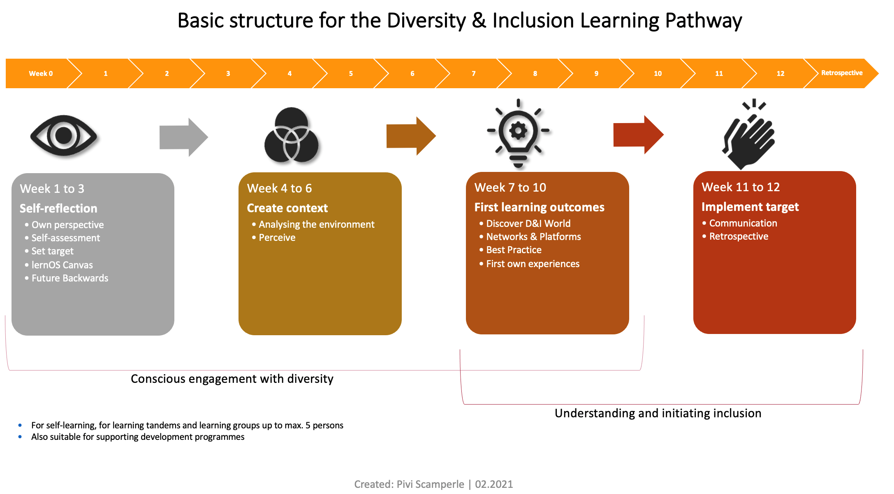

# Basics 

The verb \"lernos\" is the future tense of \"learn\" in Esperanto (mi
lernos = I will learn, ni lernos = we will learn). lernOS is an
operating system for lifelong learning and learning organisations.
lernOS is not software, however, but \"brainware\". It is a way of
thinking and acting to be successful as an individual, team or
organisation in the 21st century. The capitalised \"OS\" in the name
underlines the importance of digitalisation for our networked knowledge
society.

There are three basic guides to lernOS that describe the approach at the
individual level (lernOS for you), at the team level (lernOS for teams)
and at the organisational level (lernOS for organisations). In addition,
there is the lernOS toolbox, which explains frequently used methods and
tools (e.g. podcast, barcamp1, sketchnoting2, expert debriefing3).
lernOS was not created on the proverbial green field but is a
compilation of already existing and proven methods. All lernOS guides
are available under the open licence Creative Commons Attribution (CC
BY)^4^ on the lernOS website and may be adapted to your own needs.

If you have further questions regarding lernOS or need support from
like-minded people, you can use the community platform
[CONNECT](https://community.cogneon.de/login) or write under \#lernOS on
Twitter. Note: Mastery in lernOS is a matter of months or years, not
hours or days.

So: Keep Calm & Learn On!

## Introduction 

This lernOS guide deals with the topic of Diversity & Inclusion.
Diversity describes the similarities and differences between people.
Inclusion, on the other hand, refers to the appreciative handling of
diversity. It is not to be confused with INCLUSION, a word that is
mostly used in German-speaking countries in connection with the topic of
\"disability\". Start looking for your definition. You should especially
take a look at the broad approach to diversity of the Diversity Charter:
<https://www.charta-der-vielfalt.de/>

A few more comments up front:

This lernOS Diversity & Inclusion refers to Germany with its contents,
links and references. When adapting for other countries and translating
into other languages, you should take this into account and make the
appropriate adjustments.

It is aimed at both individuals and groups of up to 5 people. For the
sake of simplicity, we have used the \"you\" form of address throughout.
We only deviate from this where it is exclusively a matter of group
explanations. Of course, we use gender-neutral language or the gender
star. We want to use the gender star to designate all genders - even
beyond the binary identity. The star figuratively expresses the
multitude of possible genders through its rays. More information on
gender-equitable language is also available here:
<https://fairlanguage.com/>

**The learning journey at a glance**

In the next 13 weeks you will go on a learning journey. You don\'t start
at week 1, but at week 0. You choose your goal yourself, but the
learning path always navigates you along the right (content-related)
path. In the process, you will acquire basic knowledge and receive
advice on useful sources as well as exercises that will help you to
achieve your goal in terms of diversity & inclusion.

To do this, you first take stock: self-reflection - **weeks 0 to 3**.
Where do you start with the topic? First you find your goal and learn
how to formulate it. Then you determine the right starting point for
you. Here it is especially important that you name your learning goal
clearly and do not get lost in the whole breadth of the topic of
diversity.

During **weeks 4 to 6** you establish the status quo in your environment
so that you can contextualise your goal and learning journey. Diversity
& Inclusion is a broad and multi-layered topic, it does not work in a
one-size-fits-all way. That is why the context in which you move, set
and pursue your learning goal is so important. If you have done this
well, then you can look at all facets of Diversity & Inclusion and
always find your way back to your learning path. Because in the
following three weeks you will move forward on your learning journey.
You will learn methods that will help you to internalise the topic in
relation to your goal. And you will also learn what could slow you down
or distract you along the way.

In **weeks 7 to 9,** the learning path will help you become competent in
the topic, deepen your competence in diversity and generate real
learning experiences. And then it\'s time for the final spurt - in
**weeks 10 to 12** you will apply and try out what you have learned in
the weeks before.

You should plan at least 2 hours per week. There are always tips if you
want to do more. Preparation and follow-up times can vary. And don\'t
worry that it might be too much for you! You can always take a break.
You can also adjust your learning goal, go deeper into the topic or
exchange ideas with others (or in your group). If you are not motivated
or feel overwhelmed, that\'s okay. Don\'t despair! Your learning journey
is not always linear, every now and then there is a stop or the journey
is slower than planned, turns off somewhere or just wants to pause for a
moment. All that is fine, don\'t forget that. And now: have fun on your
journey!

Schematic representation of the structure of the learning path.
